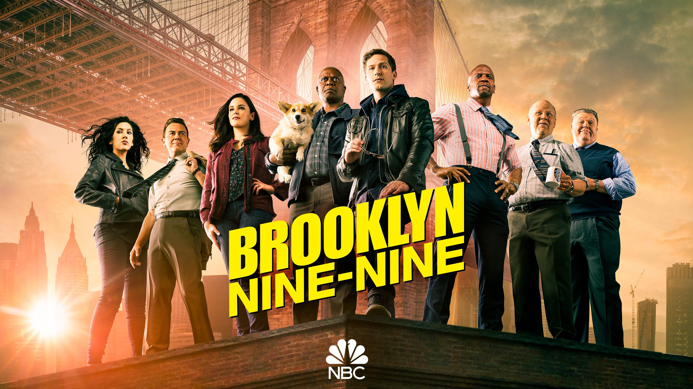

# Brooklyn99 Fan Quiz

## Tech Stack

This project was made using nodeJS, and was coded on repl.it

## About Project:
This project was made as part of level 0 of neogcamp
This is a simple CLI Quiz made for the ardent of Brooklyn 99 fans, using node JS. 

## Live Demo!:

https://user-images.githubusercontent.com/60094625/211731414-9acd75da-e3e7-4de1-8dd3-bc419af1843a.mp4

## Project Screens:

